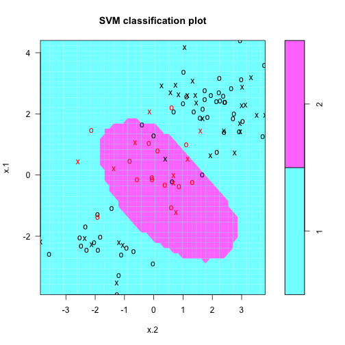
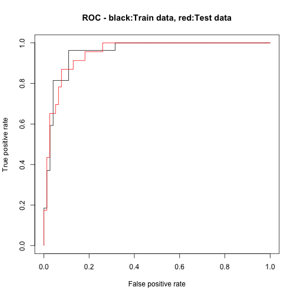

### Support Vector Machines

This Data Product provides the user a way to 
explore the effects of gamma and cost parameters on 
the Support Vector Machine model for prediction. Below
is a classification plot of two gaussian distributed population differing 
in their mean. The red points belong to population 2. Gamma = 1  Cost = 1

 

---

Gamma = 20  Cost = 1

 

--- .class #id 

### Classification and Confusion Matrix

The ConfusionMatrix is calculated to give
some numerical values on Accuracy, Sensivity, Specifity
False Positives and True positives.
<table>
<tr><td></td><td></td><td colspan=2><b>Truth</b></td></tr>
<tr><td></td><td></td><td>negative</td><td>positive</td></tr>
<tr><td><b>Prediction</b></td><td>negative</td><td>A</td><td>B</td></tr>
<tr><td></td><td>positive</td><td>C</td><td>D</td></tr>
</table>
  
<table>
<tr><td>Accuracy:</td><td>$$\frac{A + D}{A + B + C + D}$$</td></tr>
<tr><td>False Positives Rate:</td><td>$$\frac{C}{A + C}$$</td></tr>
<tr><td>True Positives Rate:</td><td>$$\frac{D}{B + D}$$</td></tr>
</table>

---

### Its 'Confussion Matrix'

<table>
<tr><td></td><td></td><td colspan=2><b>Truth</b></td></tr>
<tr><td></td><td></td><td>negative</td><td>positive</td></tr>
<tr><td><b>Prediction</b></td><td>negative</td><td>72</td><td>7</td></tr>
<tr><td></td><td>positive</td><td>5</td><td>16</td></tr>
</table>

<table>
<tr><td>Accuracy:0.88</td></tr>
<tr><td>False Positives Rate:$$\frac{7}{72 + 7}$$ = 0.0886</td></tr>
<tr><td>True Positives Rate: $$\frac{16}{5 + 16}$$ = 0.7619</td></tr>
</table>

---

### Its ROC

 
